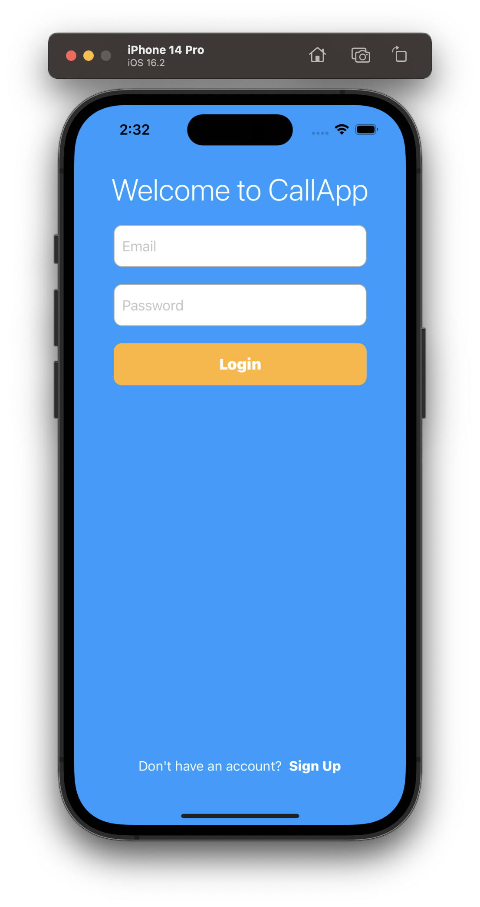
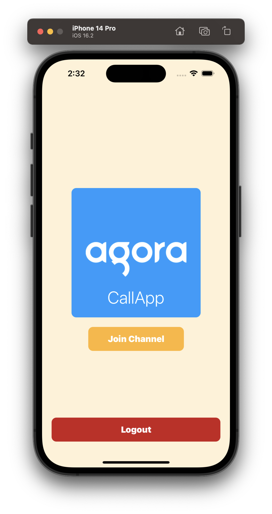
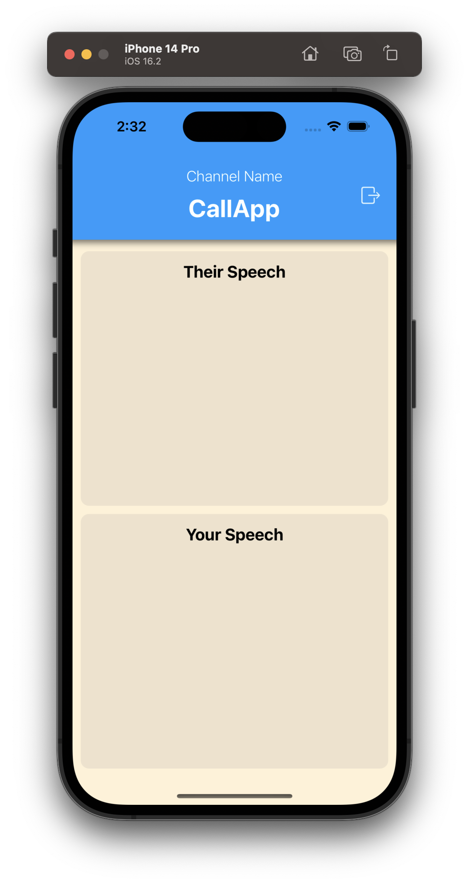
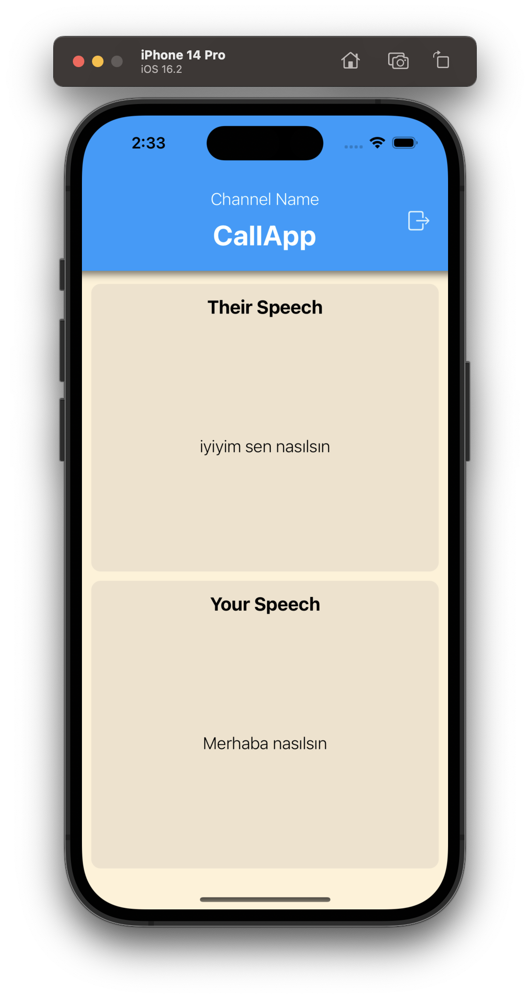

# CallApp

Voice Call Application with Agora SDK - Case Study for Articula

## Description

This is a voice call application that utilizes the Agora Voice Call SDK. The application allows users to initiate and receive voice calls, as well as use speech recognition to transcribe spoken conversations into text. The transcribed text is then stored in Firebase Firestore, where it can be accessed by other users in the same voice call.

## Technologies Used

- [Agora Voice Call SDK](https://www.agora.io/en/products/voice-call/)
- [Firebase Authentication](https://firebase.google.com/docs/auth)
- [Firebase Firestore](https://firebase.google.com/docs/firestore)
- [Speech Recognition](https://developer.apple.com/documentation/speech)
- [Text-to-Speech](https://developer.apple.com/documentation/avfoundation/speech_synthesis)
- [SnapKit](https://github.com/SnapKit/SnapKit)

## Usage

To use the application, simply sign in with your Firebase credentials and start a voice call. During the call, any spoken conversation will be transcribed into text and stored in Firebase Firestore. Other users in the same call can access the transcribed text by listening for updates to the Firestore database.

### Screen Shots

| Login and Register Page | Home Screen | Channel View |
| :---: | :---: | :---: |
|  |  |  |

| Converting Spoken Words to Text using Speech Recognition | Text-to-Speech Output for Transcribed Speech from Other Users |
| :---: | :---: |
|  |  |
